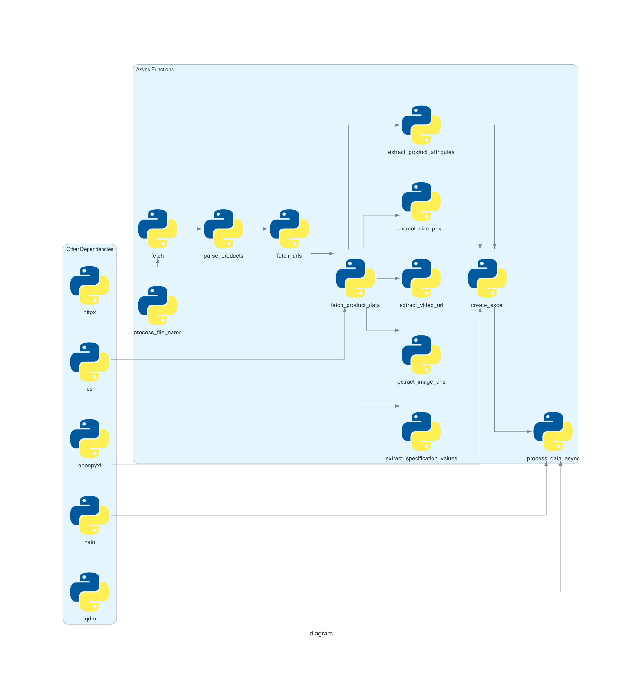

Сервис для параллельного парсинга отдельных страниц сайта https://qgold.com/

# Установка 
1. ```git clone https://github.com/KolesnikNV/BitBusters.git``` 
2. ```cd BitBuster```
3. ```poetry shell```
4. ```poetry install```
5. ```python main.py```



***P.S. Знаю, что осталвять файлы .xlsx в репозитории плохая практика, но я это сделал для демонтсрации работы кода***